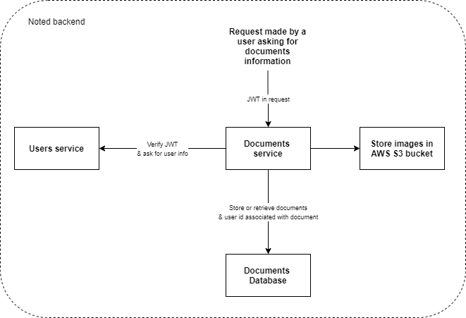

# Noted: Documents service

[](https://travis-ci.org/jsgilberto/noted-documents-service)
[](https://github.com/agconti/cookiecutter-django-rest)

### About the project

This repo contains the service for the documents in Noted app.

This service is used to manage all documents created by the users, allowing CRUD operations on them. For example, you can create or get a list of the documents owned by the user making the request to this service; when the request is processed by the service, it will ask the users service for the id of the user who is making the request passing a JSON Web Token embedded in the request.

### How does it work

Actually, this service has 2 endpoints available `/api/documents/` and `/api/documents/<document_slug>/` which execute different actions depending on the method of the request `GET,POST,PUT,PATCH,DELETE`.

<p align="center">
  
</p>

## Built with
This project was started with a cookiecutter template from gh:agconti/cookiecutter-django-rest which comes with a set of libraries for creating REST APIs with Python and Django:

- Python
- Django
- Django Rest Framework
- Postgres
- Docker
- And more

If you want to see the full list please go ahead and read the `requirements.txt` file where you can find all the used dependencies.

## Prerequisites

- [Docker](https://docs.docker.com/docker-for-mac/install/)  

## Getting started

Start the dev server for local development:
```bash
docker-compose up
```

Run a command inside the docker container:

```bash
docker-compose run --rm web [command]
```

## License

Distributed under the MIT License. See `LICENSE` for more information.

## Contact

Jesus Alvarez - in/alvarezjesus - alv.mtz94@gmail.com

Project link: https://github.com/jsgilberto/noted-documents-service

## Acknowledgements

* [cookiecutter-django-rest](https://github.com/agconti/cookiecutter-django-rest)
